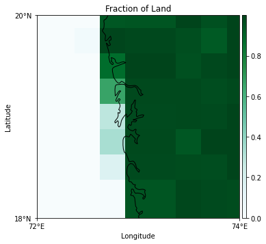
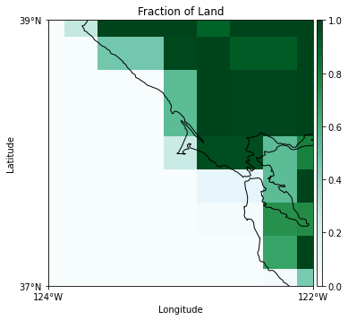
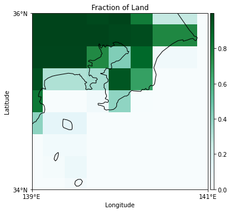
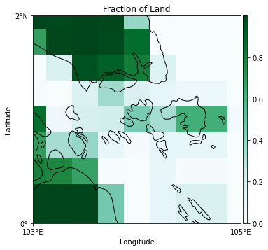
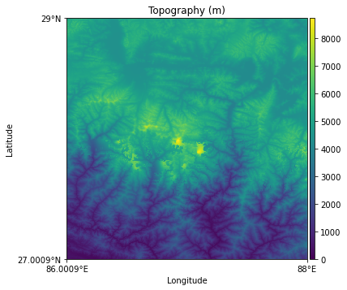

# Analysis-Ready, Cloud Optimized ERA5

Recipes for reproducing Analysis-Ready & Cloud Optimized (ARCO) ERA5 datasets.

[Introduction](#introduction) • [Roadmap](#roadmap) • [Data Description](#data-description)
• [How to reproduce](#how-to-reproduce) • [FAQs](#faqs) • [How to cite this work](#how-to-cite-this-work)
• [License](#license)

## Introduction

Our goal is to make a global history of the climate highly accessible in the cloud. To that end, we present a curated
copy of the ERA5 corpus.

<details>
<summary>What is ERA5?</summary>

ERA5 is the fifth generation of [ECMWF's](https://www.ecmwf.int/) Atmospheric Reanalysis. It spans atmospheric, land,
and ocean variables. ERA5 is an hourly dataset with global coverage at 30km resolution (~0.28° x 0.28°), ranging from
1979 to the present. The total ERA5 dataset is about 5 petabytes in size.

Check out [ECMWF's documentation on ERA5](https://www.ecmwf.int/en/forecasts/datasets/reanalysis-datasets/era5) for
more.

</details>

<details>
<summary>What is a reanalysis?</summary>

A reanalysis is the "most complete picture currently possible of past weather and climate." Reanalyses are created from
assimilation of a wide range of data sources via numerical weather prediction (NWP) models.

Read [ECMWF's introduction to reanalysis](https://www.ecmwf.int/en/about/media-centre/focus/2020/fact-sheet-reanalysis)
for more.

</details>

So far, we have ingested meteorologically valuable variables for the land and atmosphere. From this, we have produced a
cloud-optimized version of ERA5, in which we have converted [grib data](https://en.wikipedia.org/wiki/GRIB)
to [Zarr](https://zarr.readthedocs.io/) with no other modifications. Next, we plan on creating an "analysis-ready"
version, oriented towards common research workflows, which we will do in the open.

This two-pronged approach for the data serves different user needs. Some researchers need full control over the
interpolation of data for their analysis. Most will want a batteries-included dataset, where standard pre-processing and
chunk optimization is already applied. In general, we ensure that every step in this pipeline is open and reproducible,
to provide transparency in the providence of all data.

TODO([#1](https://github.com/google-research/arco-era5/issues/1)): What have we done to make this dataset possible?

**Please view out our [walkthrough notebook](https://github.com/google-research/arco-era5/blob/main/docs/0-Surface-Reanalysis-Walkthrough.ipynb) for a demo of the datasets.**

## Roadmap

1. [x] **Phase 0**: Ingest raw ERA5
2. [x] **Phase 1**: Cloud-Optimize to Zarr, without data modifications
    1. [x] Use [Pangeo-Forge](https://pangeo-forge.readthedocs.io/) to convert the data from grib to Zarr.
    2. [x] Create example notebooks for common workflows, including regridding and variable derivation.
3. [ ] **Phase 2**: Produce an Analysis-Ready corpus
    1. [ ] Regrid datasets to lat/long grids.
    2. [ ] Convert model levels to pressure levels (at high resolution).
    3. [ ] Compute derived variables.
    4. [ ] Expand on example notebooks.
4. [ ] **Phase 3**: Create an analysis & machine learning (ML) pipeline toolkit
    1. [ ] Dataset generator for ML Models.
    2. [ ] Examples of reading data in [XArray-Beam](https://xarray-beam.readthedocs.io/) pipelines.
    3. [ ] Notebooks demoing common data analysis,
       like [Extreme Value Analysis](https://en.wikipedia.org/wiki/Extreme_value_theory).
5. [ ] General future plans...
    1. [ ] Include more variables, especially ocean data.
    2. [ ] Integrate preliminary ERA5 data (1950 to 1978).
    3. [ ] Automatically update with recent data.

## Data Description

As of 2022-04-27, all data spans the dates `1979-01-01/to/2021-08-31` (inclusive).

Whenever possible, we have chosen to represent parameters by their native grid resolution.
See [this ECMWF documentation](https://confluence.ecmwf.int/display/CKB/ERA5%3A+What+is+the+spatial+reference) for more.

### Model Level Wind

* _Levels_: `1/to/137`
* _Times_: `00/to/23`
* _Grid_: `Spectral Harmonic Coefficients`
  ([docs](https://confluence.ecmwf.int/display/UDOC/How+to+access+the+data+values+of+a+spherical+harmonic+field+in+GRIB+-+ecCodes+GRIB+FAQ))
* _Size_: 305.89 TiB

> Warning: We encountered a small error in one of our source data shards (the `dve` shard for 2008-08-27 actually had
> data for 2008-_02_-27). We noticed this only after ECMWF's MARS archive went down due to
> a [data center migration.](https://www.ecmwf.int/en/about/media-centre/focus/2022/data-handling-system-move-new-data-centre-practical-implications)
> In order to release the data as soon as possible, we substituted the previous day's worth of data for this 24-hour
> period. Once the center is back online, we will re-compute this
> dataset ([#8](https://github.com/google-research/arco-era5/issues/8)).

| name                 | short name | units   | docs                                              | config                               |
|----------------------|------------|---------|---------------------------------------------------|--------------------------------------|
| vorticity (relative) | vo         | s^-1    | https://apps.ecmwf.int/codes/grib/param-db?id=138 | [era5_ml_dv.cfg](raw/era5_ml_dv.cfg) |
| divergence           | d          | s^-1    | https://apps.ecmwf.int/codes/grib/param-db?id=155 | [era5_ml_dv.cfg](raw/era5_ml_dv.cfg) |
| temperature          | t          | K       | https://apps.ecmwf.int/codes/grib/param-db?id=130 | [era5_ml_tw.cfg](raw/era5_ml_tw.cfg) |
| vertical velocity    | d          | Pa s^-1 | https://apps.ecmwf.int/codes/grib/param-db?id=135 | [era5_ml_tw.cfg](raw/era5_ml_tw.cfg) |


```python
import xarray as xr

ml_wind = xr.open_zarr(
    'gs://gcp-public-data-arco-era5/co/model-level-wind.zarr/',
    chunks={'time': 48},
    consolidated=True,
)
```

### Model Level Moisture

* _Levels_: `1/to/137`
* _Times_: `00/to/23`
* _Grid_: `N320`,
  a [Reduced Gaussian Grid](https://confluence.ecmwf.int/display/EMOS/Reduced+Gaussian+Grids) ([docs](https://www.ecmwf.int/en/forecasts/documentation-and-support/gaussian_n320))
* _Size_: 707.34 TiB

| name                                | short name | units    | docs                                              | config                                   |
|-------------------------------------|------------|----------|---------------------------------------------------|------------------------------------------|
| specific humidity                   | q          | kg kg^-1 | https://apps.ecmwf.int/codes/grib/param-db?id=133 | [era5_ml_o3q.cfg](raw/era5_ml_o3q.cfg)   |
| ozone mass mixing ratio             | o3         | kg kg^-1 | https://apps.ecmwf.int/codes/grib/param-db?id=203 | [era5_ml_o3q.cfg](raw/era5_ml_o3q.cfg)   | 
| specific cloud liquid water content | clwc       | kg kg^-1 | https://apps.ecmwf.int/codes/grib/param-db?id=246 | [era5_ml_o3q.cfg](raw/era5_ml_o3q.cfg)   | 
| specific cloud ice water content    | ciwc       | kg kg^-1 | https://apps.ecmwf.int/codes/grib/param-db?id=247 | [era5_ml_o3q.cfg](raw/era5_ml_o3q.cfg)   |
| fraction of cloud cover             | cc         | (0 - 1)  | https://apps.ecmwf.int/codes/grib/param-db?id=248 | [era5_ml_o3q.cfg](raw/era5_ml_o3q.cfg)   |
| specific rain water content         | crwc       | kg kg^-1 | https://apps.ecmwf.int/codes/grib/param-db?id=75  | [era5_ml_qrqs.cfg](raw/era5_ml_qrqs.cfg) |
| specific snow water content         | cswc       | kg kg^-1 | https://apps.ecmwf.int/codes/grib/param-db?id=76  | [era5_ml_qrqs.cfg](raw/era5_ml_qrqs.cfg) |

```python
import xarray as xr

ml_moisture = xr.open_zarr(
    'gs://gcp-public-data-arco-era5/co/model-level-moisture.zarr/',
    chunks={'time': 48},
    consolidated=True,
)
```

### Single Level Reanalysis

* _Times_: `00/to/23`
* _Grid_: `N320`,
  a [Reduced Gaussian Grid](https://confluence.ecmwf.int/display/EMOS/Reduced+Gaussian+Grids) ([docs](https://www.ecmwf.int/en/forecasts/documentation-and-support/gaussian_n320))
* _Size_: 28.02 TiB

| name                                                       | short name | units        | docs                                                 | config                                       |
|------------------------------------------------------------|------------|--------------|------------------------------------------------------|----------------------------------------------|
| convective available potential energy                      | cape       | J kg^-1      | https://apps.ecmwf.int/codes/grib/param-db?id=59     | [era5_sfc_cape.cfg](raw/era5_sfc_cape.cfg)   |
| total column cloud ice water                               | tciw       | kg m^-2      | https://apps.ecmwf.int/codes/grib/param-db?id=79     | [era5_sfc_cape.cfg](raw/era5_sfc_cape.cfg)   |
| vertical integral of divergence of cloud frozen water flux | wiiwd      | kg m^-2 s^-1 | https://apps.ecmwf.int/codes/grib/param-db?id=162080 | [era5_sfc_cape.cfg](raw/era5_sfc_cape.cfg)   |
| 100 metre U wind component                                 | 100u       | m s^-1       | https://apps.ecmwf.int/codes/grib/param-db?id=228246 | [era5_sfc_cape.cfg](raw/era5_sfc_cape.cfg)   |
| 100 metre V wind component                                 | 100v       | m s^-1       | https://apps.ecmwf.int/codes/grib/param-db?id=228247 | [era5_sfc_cape.cfg](raw/era5_sfc_cape.cfg)   |
| sea ice area fraction                                      | ci         | (0 - 1)      | https://apps.ecmwf.int/codes/grib/param-db?id=31     | [era5_sfc_cisst.cfg](raw/era5_sfc_cisst.cfg) | 
| sea surface temperature                                    | sst        | Pa           | https://apps.ecmwf.int/codes/grib/param-db?id=34     | [era5_sfc_cisst.cfg](raw/era5_sfc_cisst.cfg) |
| skin temperature                                           | skt        | K            | https://apps.ecmwf.int/codes/grib/param-db?id=235    | [era5_sfc_cisst.cfg](raw/era5_sfc_cisst.cfg) |
| soil temperature level 1                                   | stl1       | K            | https://apps.ecmwf.int/codes/grib/param-db?id=139    | [era5_sfc_soil.cfg](raw/era5_sfc_soil.cfg)   | 
| soil temperature level 2                                   | stl2       | K            | https://apps.ecmwf.int/codes/grib/param-db?id=170    | [era5_sfc_soil.cfg](raw/era5_sfc_soil.cfg)   |
| soil temperature level 3                                   | stl3       | K            | https://apps.ecmwf.int/codes/grib/param-db?id=183    | [era5_sfc_soil.cfg](raw/era5_sfc_soil.cfg)   |
| soil temperature level 4                                   | stl4       | K            | https://apps.ecmwf.int/codes/grib/param-db?id=236    | [era5_sfc_soil.cfg](raw/era5_sfc_soil.cfg)   |
| temperature of snow layer                                  | tsn        | K            | https://apps.ecmwf.int/codes/grib/param-db?id=238    | [era5_sfc_soil.cfg](raw/era5_sfc_soil.cfg)   |
| volumetric soil water layer 1                              | swvl1      | m^3 m^-3     | https://apps.ecmwf.int/codes/grib/param-db?id=39     | [era5_sfc_soil.cfg](raw/era5_sfc_soil.cfg)   |
| volumetric soil water layer 2                              | swvl2      | m^3 m^-3     | https://apps.ecmwf.int/codes/grib/param-db?id=40     | [era5_sfc_soil.cfg](raw/era5_sfc_soil.cfg)   |
| volumetric soil water layer 3                              | swvl3      | m^3 m^-3     | https://apps.ecmwf.int/codes/grib/param-db?id=41     | [era5_sfc_soil.cfg](raw/era5_sfc_soil.cfg)   |
| volumetric soil water layer 4                              | swvl4      | m^3 m^-3     | https://apps.ecmwf.int/codes/grib/param-db?id=42     | [era5_sfc_soil.cfg](raw/era5_sfc_soil.cfg)   |
| ice temperature layer 1                                    | istl1      | K            | https://apps.ecmwf.int/codes/grib/param-db?id=35     | [era5_sfc_soil.cfg](raw/era5_sfc_soil.cfg)   |
| ice temperature layer 2                                    | istl2      | K            | https://apps.ecmwf.int/codes/grib/param-db?id=36     | [era5_sfc_soil.cfg](raw/era5_sfc_soil.cfg)   |
| ice temperature layer 3                                    | istl3      | K            | https://apps.ecmwf.int/codes/grib/param-db?id=37     | [era5_sfc_soil.cfg](raw/era5_sfc_soil.cfg)   |
| ice temperature layer 4                                    | istl4      | K            | https://apps.ecmwf.int/codes/grib/param-db?id=38     | [era5_sfc_soil.cfg](raw/era5_sfc_soil.cfg)   |
| total column cloud liquid water                            | tclw       | kg m^-2      | https://apps.ecmwf.int/codes/grib/param-db?id=78     | [era5_sfc_tcol.cfg](raw/era5_sfc_tcol.cfg)   | 
| total column rain water                                    | tcrw       | kg m^-2      | https://apps.ecmwf.int/codes/grib/param-db?id=228089 | [era5_sfc_tcol.cfg](raw/era5_sfc_tcol.cfg)   |
| total column snow water                                    | tcsw       | kg m^-2      | https://apps.ecmwf.int/codes/grib/param-db?id=228090 | [era5_sfc_tcol.cfg](raw/era5_sfc_tcol.cfg)   |
| total column water                                         | tcw        | kg m^-2      | https://apps.ecmwf.int/codes/grib/param-db?id=136    | [era5_sfc_tcol.cfg](raw/era5_sfc_tcol.cfg)   |
| total column vertically-integrated water vapour            | tcwv       | kg m^-2      | https://apps.ecmwf.int/codes/grib/param-db?id=137    | [era5_sfc_tcol.cfg](raw/era5_sfc_tcol.cfg)   |

```python
import xarray as xr

sl_reanalysis = xr.open_zarr(
    'gs://gcp-public-data-arco-era5/co/single-level-reanalysis.zarr', 
    chunks={'time': 48},
    consolidated=True,
)
```
### Single Level Forecast

* _Times_: `06:00/18:00`
* _Steps_: `0/1/2/3/4/5/6/7/8/9/10/11/12/13/14/15/16/17/18`
* _Grid_: `N320`,
  a [Reduced Gaussian Grid](https://confluence.ecmwf.int/display/EMOS/Reduced+Gaussian+Grids) ([docs](https://www.ecmwf.int/en/forecasts/documentation-and-support/gaussian_n320))
* _Size_: 24.52 TiB

| name                                       | short name | units                 | docs                                                 | config                                   |
|--------------------------------------------|------------|-----------------------|------------------------------------------------------|------------------------------------------|
| snow density                               | rsn        | kg m^-3               | https://apps.ecmwf.int/codes/grib/param-db?id=33     | [era5_sfc_pcp.cfg](raw/era5_sfc_pcp.cfg) | 
| snow evaporation                           | es         | m of water equivalent | https://apps.ecmwf.int/codes/grib/param-db?id=44     | [era5_sfc_pcp.cfg](raw/era5_sfc_pcp.cfg) | 
| snow melt                                  | smlt       | m of water equivalent | https://apps.ecmwf.int/codes/grib/param-db?id=45     | [era5_sfc_pcp.cfg](raw/era5_sfc_pcp.cfg) | 
| large-scale precipitation fraction         | lspf       | s                     | https://apps.ecmwf.int/codes/grib/param-db?id=50     | [era5_sfc_pcp.cfg](raw/era5_sfc_pcp.cfg) | 
| snow depth                                 | sd         | m of water equivalent | https://apps.ecmwf.int/codes/grib/param-db?id=141    | [era5_sfc_pcp.cfg](raw/era5_sfc_pcp.cfg) |
| large-scale precipitation                  | lsp        | m                     | https://apps.ecmwf.int/codes/grib/param-db?id=142    | [era5_sfc_pcp.cfg](raw/era5_sfc_pcp.cfg) |
| convective precipitation                   | cp         | m                     | https://apps.ecmwf.int/codes/grib/param-db?id=143    | [era5_sfc_pcp.cfg](raw/era5_sfc_pcp.cfg) |
| snowfall                                   | sf         | m of water equivalent | https://apps.ecmwf.int/codes/grib/param-db?id=144    | [era5_sfc_pcp.cfg](raw/era5_sfc_pcp.cfg) |
| convective rain rate                       | crr        | kg m^-2 s^-1          | https://apps.ecmwf.int/codes/grib/param-db?id=228218 | [era5_sfc_pcp.cfg](raw/era5_sfc_pcp.cfg) |
| large scale rain rate                      | lsrr       | kg m^-2 s^-1          | https://apps.ecmwf.int/codes/grib/param-db?id=228219 | [era5_sfc_pcp.cfg](raw/era5_sfc_pcp.cfg) |
| convective snowfall rate water equivalent  | csfr       | kg m^-2 s^-1          | https://apps.ecmwf.int/codes/grib/param-db?id=228220 | [era5_sfc_pcp.cfg](raw/era5_sfc_pcp.cfg) |
| large scale snowfall rate water equivalent | lssfr      | kg m^-2 s^-1          | https://apps.ecmwf.int/codes/grib/param-db?id=228221 | [era5_sfc_pcp.cfg](raw/era5_sfc_pcp.cfg) |
| total precipitation                        | tp         | m                     | https://apps.ecmwf.int/codes/grib/param-db?id=228    | [era5_sfc_pcp.cfg](raw/era5_sfc_pcp.cfg) | 
| convective snowfall                        | csf        | m of water equivalent | https://apps.ecmwf.int/codes/grib/param-db?id=239    | [era5_sfc_pcp.cfg](raw/era5_sfc_pcp.cfg) | 
| large-scale snowfall                       | lsf        | m of water equivalent | https://apps.ecmwf.int/codes/grib/param-db?id=240    | [era5_sfc_pcp.cfg](raw/era5_sfc_pcp.cfg) |
| precipitation type                         | ptype      | code table (4.201)    | https://apps.ecmwf.int/codes/grib/param-db?id=260015 | [era5_sfc_pcp.cfg](raw/era5_sfc_pcp.cfg) |
| surface solar radiation downwards          | ssrd       | J m^-2                | https://apps.ecmwf.int/codes/grib/param-db?id=169    | [era5_sfc_rad.cfg](raw/era5_sfc_pcp.cfg) | 
| top net thermal radiation                  | ttr        | J m^-2                | https://apps.ecmwf.int/codes/grib/param-db?id=179    | [era5_sfc_rad.cfg](raw/era5_sfc_rad.cfg) |
| gravity wave dissipation                   | gwd        | J m^-2                | https://apps.ecmwf.int/codes/grib/param-db?id=197    | [era5_sfc_rad.cfg](raw/era5_sfc_rad.cfg) |
| surface thermal radiation downwards        | strd       | J m^-2                | https://apps.ecmwf.int/codes/grib/param-db?id=175    | [era5_sfc_rad.cfg](raw/era5_sfc_rad.cfg) |
| surface net thermal radiation              | str        | J m^-2                | https://apps.ecmwf.int/codes/grib/param-db?id=177    | [era5_sfc_rad.cfg](raw/era5_sfc_rad.cfg) |

```python
import xarray as xr

sl_forecasts = xr.open_zarr(
    'gs://gcp-public-data-arco-era5/co/single-level-forecast.zarr/', 
    chunks={'time': 48},
    consolidated=True,
)
```

## How to reproduce

All phases of this dataset can be reproduced with scripts found here. To run them, please clone the repo and install the
project.

```shell
git clone https://github.com/google-research/arco-era5.git
```

Or, via SSH:

```shell
git clone git@github.com:google-research/arco-era5.git
```

Then, install with `pip`:

```shell
cd arco-era5
pip install -e .
```

### Acquire & preprocess raw data

Please consult the [instructions described in `raw/`](raw).

### Cloud-Optimization

All our tools make use of Apache Beam, and thus
are [portable to any cloud (or Runner)](https://beam.apache.org/documentation/runners/capability-matrix/). We use GCP's
[Dataflow](https://cloud.google.com/dataflow) to produce this dataset. If you would like to reproduce the project this
way, we recommend the following:

1. Ensure you have access to a GCP project with GCS read & write access, as well as full Dataflow permissions (see these
   ["Before you begin" instructions](https://cloud.google.com/dataflow/docs/quickstarts/create-pipeline-python)).
2. Export the following variables:
   ```shell
   export PROJECT=<your-gcp-project>
   export REGION=us-central1
   export BUCKET=<your-beam-runner-bucket>
   ```

From here, we provide examples of how to run the recipes at the top of each script.

```shell
pydoc src/single-levels-to-zarr.py
```

You can also discover available command line options by invoking the script with `-h/--help`:

```shell
python src/model-levels-to-zarr.py --help
```

### Making the dataset "Analysis Ready" & beyond...

This phase of the project is under active development! If you would like to lend a hand in any way, please check out our
[contributing guide](CONTRIBUTING.md).

## FAQs

### How did you pick these variables?

This dataset originated in [Loon](https://x.company/projects/loon/), Alphabet’s project to deliver internet service
using stratospheric balloons, and is now curated by Google Research & Google Cloud Platform. Loon’s Planning, Simulation
and Control team needed accurate data on how the stratospheric winds have behaved in the past to evaluate the
effectiveness of different balloon steering algorithms over a range of weather. This led us to download the model-level
data. But Loon also needed information about the atmospheric radiation to model balloon gas temperatures, so we
downloaded that. And then we downloaded the most commonly used meteorological variables to support different product
planning needs (RF propagation models, etc)...

Eventually, we found ourselves with a comprehensive history of weather for the world.

### Where are the U/V components of wind? Where is geopotential height? Why isn’t `X` variable in this dataset?

We intentionally did not include many variables that can be derived from other variables. For example, U/V components of
wind can be computed from divergence and vorticity; geopotential is a vertical integral of temperature.

In the second phase of our roadmap (towards "Analysis Ready" data), we aim to compute all of these variables ourselves.
If you’d like to make use of these parameters sooner, please check out our example notebooks where we demo common
calculations. If you notice non-derived missing data, such as surface variables, please let us know of your needs
by [filing an issue](https://github.com/google-research/arco-era5/issues), and we will be happy to incorporate them into
our roadmap.

### Do you have plans to get _all_ of ERA5?

We aim to support hosting data that serves general meteorological use cases, rather than aim for total completeness.
Wave variables are missing from this corpus, and are a priority on our roadmap. If there is a variable or dataset that
you think should be included here, please file a [Github issue](https://github.com/google-research/arco-era5/issues).

For a complete ERA5 mirror, we recommend consulting with
the [Pangeo Forge project](https://pangeo-forge.readthedocs.io/)
(especially [staged-recipes#92](https://github.com/pangeo-forge/staged-recipes/issues/92)).

### Why are there two model-level datasets and not one?

It definitely is possible for all model level data to be represented in one grid, and thus one dataset. However, we
opted to preserve the native representation for variables in ECMWF's models. A handful of core model variables (wind,
temperature and surface pressure) are represented
as [spectral harmonic coefficients](https://confluence.ecmwf.int/display/UDOC/How+to+access+the+data+values+of+a+spherical+harmonic+field+in+GRIB+-+ecCodes+GRIB+FAQ)
, while everything else is stored on a Gaussian grid. This avoids introducing numerical error by interpolating these
variables to physical space. For a more in depth review of this topic, please consult these references:

* [_Fundamentals of Numerical Weather Prediction_](https://doi.org/10.1017/CBO9780511734458) by Jean Coiffier
* [_Atmospheric modeling, data assimilation, and predictability_](https://doi.org/10.1017/CBO9780511802270) by Eugenia
  Kalnay

Please note: in a future releases, we intend to create a dataset version where all model levels are in one grid and
Zarr.

### Why doesn’t this project make use of Pangeo Forge Cloud?

We are big fans of the [Pangeo Forge project](https://pangeo-forge.readthedocs.io/), and of [Pangeo](https://pangeo.io/)
in general. While this project does make use of [their Recipes](https://github.com/pangeo-forge/pangeo-forge-recipes),
we have a few reasons to not use their cloud. First, we would prefer to use internal rather than community resources for
computations of this scale. In addition, there are several technical reasons why Pangeo Forge as it is today would not
be able to handle this case ([0](https://github.com/pangeo-forge/staged-recipes/issues/92#issuecomment-959481038),
[1](https://github.com/pangeo-forge/pangeo-forge-recipes/issues/244),
[2](https://github.com/pangeo-forge/pangeo-forge-recipes/pull/245#issuecomment-997070261),
[3](https://github.com/pangeo-forge/pangeo-forge-recipes/issues/256)). To work around this, we opted to combine
familiar-to-us infrastructure with Pangeo-Forge's core and to use
the [right tool](https://github.com/google/weather-tools/) for the right job.

### Why use this dataset? What uses are there for the data?

ERA5 can be used in many applications. It can be used to train ML models that predict the impact of weather on different
phenomena. ERA5 data could also be used to train and evaluate ML models that forecast the weather. The data could be
used to compute climatologies, or the average weather for a region over a given period of time. ERA5 data can be used to
visualize and study historical weather events, such as Hurricane Sandy.

### Where should I be cautious? What are the limitations of the dataset?

|                                                                         |                                                                               |
|:-----------------------------------------------------------------------:|:-----------------------------------------------------------------------------:|
|  <br> Mumbai, India |  <br> San Francisco, USA |
|   <br> Tokyo, Japan   |       <br> Singapore       |

|                                                                                |                                                                                               |
|:------------------------------------------------------------------------------:|:---------------------------------------------------------------------------------------------:|
|  <br> ERA5 Topography |  <br> GMTED2010 Topography |

It is important to remember that a reanalysis is an estimate of what the weather was, it is not guaranteed to be an
error-free estimate. There are several areas where the novice reanalysis user should be careful.

First, the user should be careful using reanalysis data at locations near coastlines. The first figure shows the
fraction of land (1 for land, 0 for ocean) of ERA5 grid points at different coastal locations. This is important because
the land-surface model used in ERA5 tries to blend in the influence of water with the influence of land based on this
fraction. The most visible effect of this blending is that as the fraction of land decreases, the daily variation in
temperature will also decrease. Looking at the first figure, there are sharp changes in the fraction of land between
neighboring grid cells so there could be differences in daily temperature range that might not be reflected in actual
weather observations.

The user should also be careful when using reanalysis data in areas with large variations in topography. The second
figure is a plot of ERA5 topography around Mount Everest compared with GMTED2010 topography. The ERA5 topography is
completely missing the high peaks of the Everest region and missing most of the structure of the mountain valleys.
Topography strongly influences temperature and precipitation rate, so it is possible that ERA5’s temperature is too warm
and ERA5’s precipitation patterns could be wrong as well.

ERA5’s precipitation variables aren’t directly constrained by any observations, so we strongly encourage the user to
check ERA5 against observed precipitation (for example, [Wu et al., 2022](https://doi.org/10.1175/JHM-D-21-0195.1)). A
study comparing reanalyses (not including ERA5) against gridded precipitation observations showed striking differences
between reanalyses and observation [Lisa V Alexander et al 2020 Environ. Res. Lett. 15 055002](
https://iopscience.iop.org/article/10.1088/1748-9326/ab79e2).

### Can I use the data for {research,commercial} purposes?

Yes, you can use our ERA5 data according to the terms of
the [Copernicus license](https://cds.climate.copernicus.eu/api/v2/terms/static/licence-to-use-copernicus-products.pdf).

Researchers, see the [next section](#how-to-cite-this-work) for how to cite this work.

Commercial users, please be sure to provide acknowledgement to the Copernicus Climate Change Service according to
the [Copernicus Licence](https://cds.climate.copernicus.eu/api/v2/terms/static/licence-to-use-copernicus-products.pdf)
terms.

## How to cite this work

TODO([#6](https://github.com/google-research/arco-era5/issues/6)): Please use our soon-to-come citation.

In addition, please cite the ERA5 dataset accordingly:

```
Hersbach, H., Bell, B., Berrisford, P., Hirahara, S., Horányi, A., 
Muñoz‐Sabater, J., Nicolas, J., Peubey, C., Radu, R., Schepers, D., 
Simmons, A., Soci, C., Abdalla, S., Abellan, X., Balsamo, G., 
Bechtold, P., Biavati, G., Bidlot, J., Bonavita, M., De Chiara, G., 
Dahlgren, P., Dee, D., Diamantakis, M., Dragani, R., Flemming, J., 
Forbes, R., Fuentes, M., Geer, A., Haimberger, L., Healy, S., 
Hogan, R.J., Hólm, E., Janisková, M., Keeley, S., Laloyaux, P., 
Lopez, P., Lupu, C., Radnoti, G., de Rosnay, P., Rozum, I., Vamborg, F.,
Villaume, S., Thépaut, J-N. (2017): Complete ERA5: Fifth generation of 
ECMWF atmospheric reanalyses of the global climate. Copernicus Climate 
Change Service (C3S) Data Store (CDS). (Accessed on DD-MM-YYYY)

Hersbach et al, (2017) was downloaded from the Copernicus Climate Change 
Service (C3S) Climate Data Store. We thank C3S for allowing us to 
redistribute the data.

The results contain modified Copernicus Climate Change Service 
information 2022. Neither the European Commission nor ECMWF is 
responsible for any use that may be made of the Copernicus information 
or data it contains.
```

## License

This is not an official Google product.

```
Copyright 2022 Google LLC

Licensed under the Apache License, Version 2.0 (the "License");
you may not use this file except in compliance with the License.
You may obtain a copy of the License at

    https://www.apache.org/licenses/LICENSE-2.0

Unless required by applicable law or agreed to in writing, software
distributed under the License is distributed on an "AS IS" BASIS,
WITHOUT WARRANTIES OR CONDITIONS OF ANY KIND, either express or implied.
See the License for the specific language governing permissions and
limitations under the License.
```
